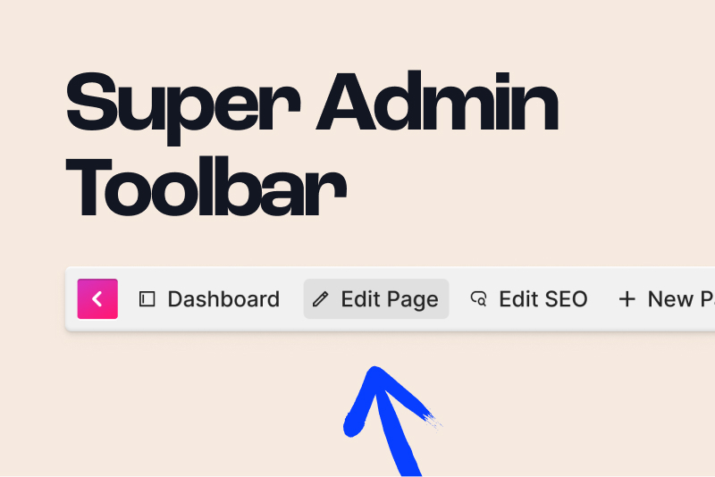

<!-- statamic:hide -->




<!-- /statamic:hide -->

# Super Admin Toolbar

An admin toolbar for Statamic 5 that streamlines content management for editors and copywriters.

## Features

- **Admin Toolbar**: Displays a toolbar for quick administrative actions when a user with `access cp` is signed in.
- **Quick Edit Links**: Easily edit the current entry or quickly create a new entry in the same collection.
- **Site Switcher**: Seamlessly switch between multi-sites right from the toolbar.
- **Lazy Loaded**: Injected via JavaScript, ensuring minimal impact on initial page load.
- **Static Cache Compatible**: Works smoothly with Statamic's static caching approach.
- **SEO Pro Integration**: Convenient shortcuts to SEO Pro settings (when installed).

## Installation

Require it via Composer:

```bash
composer require superinteractive/statamic-super-admin-toolbar
```

To ensure the Super Admin Toolbar is injected where you need it, add the following to your layout file **before** the closing `</head>` tag:

#### Antlers:

```html
{{ super_admin_toolbar }}
```

#### Blade:

```blade
<s:super_admin_toolbar />
```

## Usage

Once installed, the Super Admin Toolbar automatically loads for users with the `access cp` permission. By default, the toolbar is lazy-loaded using JavaScript, ensuring compatibility with static caching.

## Support

For issues or feature requests, please visit the [GitHub issues page](https://github.com/superinteractive/statamic-super-admin-toolbar).

## License

The MIT License (MIT). Please see the [License File](https://github.com/superinteractive/statamic-super-admin-toolbar/blob/main/LICENSE.md) for more information.
